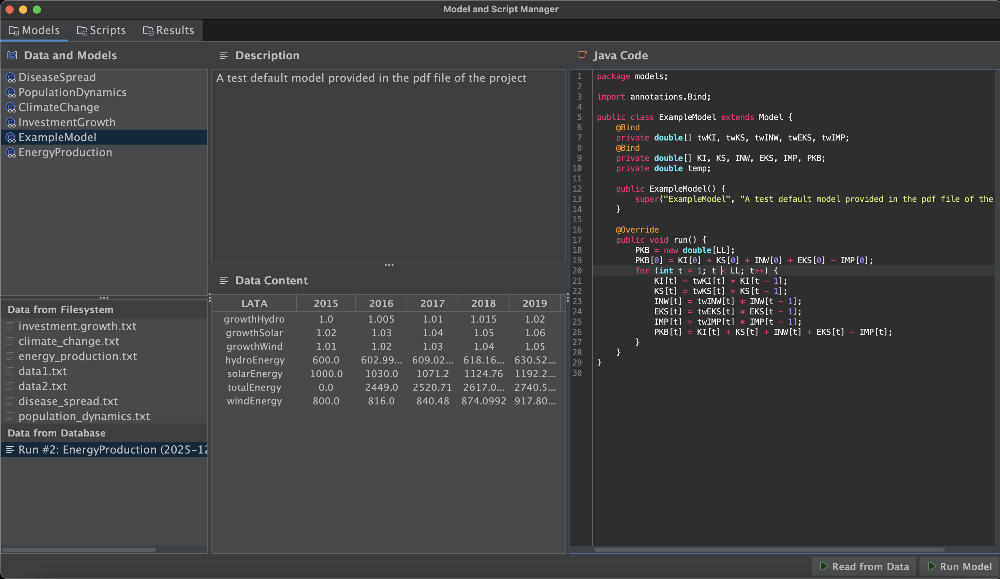
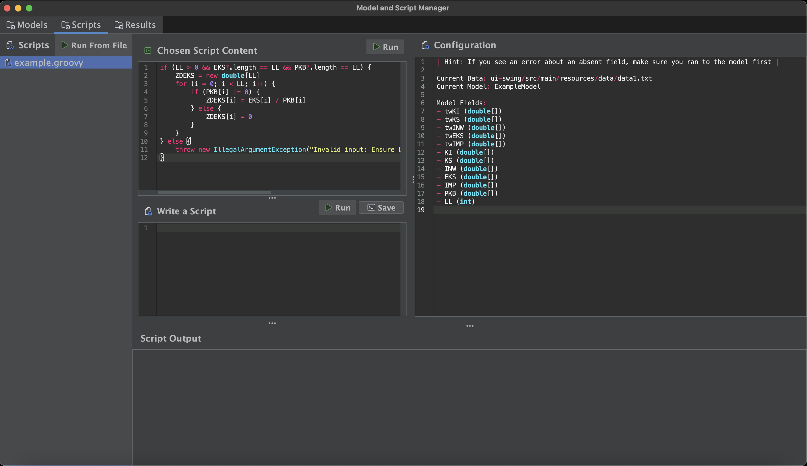
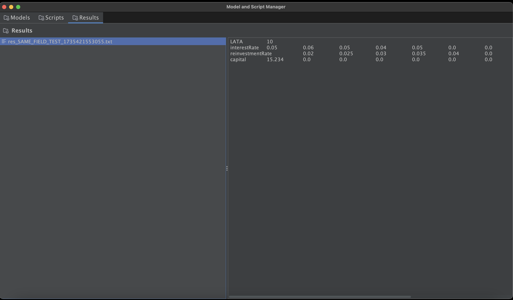

# Model Simulator & Scripting Platform

Java platform for running dynamic simulations, featuring an event-driven Spring Boot backend with Apache Kafka, a Dockerized TimescaleDB/PostgreSQL database, and a Swing-based desktop UI for scripting and data visualization. The project is fully containerized and includes configurations for CI/CD and Kubernetes deployment.

## Screenshots





## Functionality

- **Multi-Module Architecture**: Maven multi-module setup (`backend`, `simulation-core`, `ui-swing`, `simulation-api`) for clear separation of concerns.
- **Asynchronous Backend**: The Spring Boot backend uses Apache Kafka to process long-running simulations asynchronously, ensuring the UI remains responsive.
- **Groovy Scripting**: An integrated `RSyntaxTextArea` editor allows users to write and execute Groovy scripts against model parameters.
- **Persistent Storage**: All user-generated content, including scripts and simulation results, is persisted in a PostgreSQL/TimescaleDB database.
- **Containerized Environment**: The entire application stack (Backend, Kafka, Database) is fully containerized using Docker.
- **CI/CD Pipeline**: A GitHub Actions workflow automates testing, building, and publishing the backend's Docker image to Docker Hub.
- **Kubernetes Ready**: Includes Kubernetes manifests for deploying the application to a cluster environment like Minikube.
- **Integration Testing**: Uses Testcontainers to run true-to-production integration tests against a real Kafka instance.

## Tech Stack

- **Backend**: Java 17, Spring Boot 3, Spring Data JPA, Hibernate, Spring Kafka, Spring Boot Actuator.
- **Messaging / Event Streaming**: Apache Kafka.
- **Database**: Dockerized TimescaleDB / PostgreSQL.
- **Containerization & Orchestration**: Docker, Kubernetes (Minikube).
- **CI/CD & DevOps**: GitHub Actions, Maven, Shell Scripting.
- **Testing**: JUnit 5, Mockito, Testcontainers.
- **GUI**: Java Swing, FlatLaf, RSyntaxTextArea.
- **API Client**: OkHttp3, Jackson.
- **Core/Scripting**: Groovy.

## Project Structure

- `simulation-api`: DTOs for client-server communication.
- `simulation-core`: Abstract simulation logic, model definitions, and the Groovy script execution controller.
- `backend`: Spring Boot application exposing the simulation core via a REST API.
- `ui-swing`: The desktop GUI for user interaction.
- `.github/workflows`: CI/CD pipeline definitions for GitHub Actions.
- `k8s`: Kubernetes manifests for deployment.

## Getting Started

### Prerequisites

- Java (JDK) 17 or later.
- Apache Maven 3.8+
- Docker and Docker Compose.
- An IDE like IntelliJ IDEA (recommended).
- [Minikube](https://minikube.sigs.k8s.io/docs/start/) and [kubectl](https://kubernetes.io/docs/tasks/tools/install-kubectl/) (for Kubernetes deployment).

### How to Run

There are two primary ways to run the application: using Docker Compose for simple local setup, or deploying to a local Kubernetes cluster with the dev script.

#### Option A: Using Docker Compose (Simple)

1.  **Start Infrastructure**:
    ```sh
    docker-compose up -d
    ```
    This will start PostgreSQL and Kafka on `localhost`.

2.  **Run the Backend**:
    Launch the `BackendApplication` run configuration in your IDE or run `mvn spring-boot:run` inside the `backend` directory.

3.  **Run the GUI Client**:
    Launch the `UI` run configuration in your IDE or run `mvn exec:java` inside the `ui-swing` directory.

#### Option B: Using the Kubernetes Development Script (Advanced)

The `start-dev.sh` script automates the entire process of building and deploying the application to a local Minikube cluster.

1.  **Make the script executable**:
    ```sh
    chmod +x start-dev.sh
    ```
2.  **Run the script**:
    ```sh
    ./start-dev.sh
    ```
    This script will handle starting Minikube, building the Docker image, deploying all components to Kubernetes, and launching the UI.

## API Endpoints

The backend provides a RESTful API for managing simulations, scripts, and results.

### Simulations

- `POST /api/simulations/run`: Submits a new simulation task to a Kafka topic for asynchronous execution. Returns immediately with a `QUEUED` status.
- `GET /api/simulations/runs`: Returns a list of all simulation runs.
- `GET /api/simulations/{runId}/results`: Returns the detailed time-series results for a specific simulation run.

### Storage (Scripts & Results)

- `POST /api/storage/scripts`: Creates a new script in the database.
- `GET /api/storage/scripts`: Returns a list of all saved scripts (metadata only).
- `GET /api/storage/scripts/{id}`: Retrieves a specific script by ID, including its full content.
- `POST /api/storage/results`: Saves a new result to the database.
- `GET /api/storage/results`: Returns a list of all saved results (metadata only).
- `GET /api/storage/results/{id}`: Retrieves a specific result by ID, including its full content.
